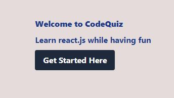
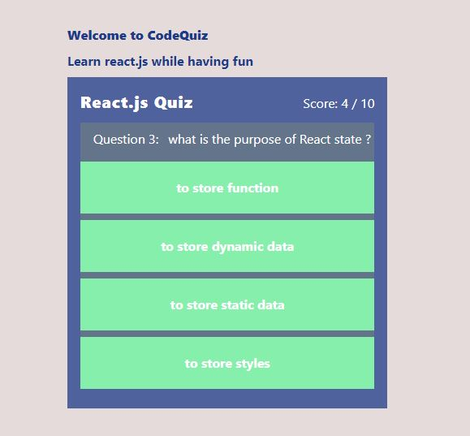
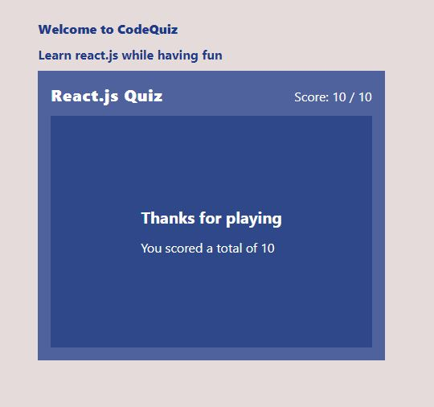

# CodeQuiz

Welcome to CodeQuiz, a React.js application where you can learn while having fun with quizzes!

## Description

CodeQuiz is a web application built with React.js that aims to make learning interactive and enjoyable. It provides a collection of quizzes on React.js and allows users to test their knowledge. Whether you're a beginner learning React.js CodeQuiz offers a fun way to challenge yourself and improve your skills.

The application is designed to be user-friendly and intuitive. It provides a welcoming interface where users can easily navigate through. Each quiz is designed to test the user's understanding of React.js concepts. Upon completion, users receive immediate feedback on their score.

## Screenshots of CodeQuiz app

  

    
    
    
  
 
 

## Deployment link  [Vercel link](quiz-dfna1dywv-nancy77zion.vercel.app) 

## Features

- Interactive quizzes to test your React.js knowledge
- User-friendly interface for easy navigation
- Immediate feedback on quiz results
- Track your progress and improve your skills

## Styling with Tailwind CSS

CodeQuiz utilizes [Tailwind CSS](https://tailwindcss.com) for styling. Tailwind CSS is a utility-first CSS framework that provides a set of pre-designed CSS classes to rapidly build custom user interfaces. It offers a wide range of utility classes that can be combined to create beautiful and responsive designs without writing custom CSS from scratch.

With Tailwind CSS, Quizzy achieves consistent styling across the application, ensuring a visually appealing and cohesive user experience. The framework's flexibility allows for easy customization and extension, enabling you to tailor the application's appearance to suit your preferences or branding requirements.

## Installation

1. Clone the repository: `git clone https://github.com/nancy77zion/Quiz-App.git`
2. Navigate to the project directory: `cd [project folder]`
3. Install the dependencies: `yarn create vite`

## Usage

1. Start the application: `yarn dev`
2. Open your browser and visit `http://localhost:5173`
3. You will be greeted with the welcome screen of Quizzy.
4. Click on the "Get Started Here" button to start the quiz.
5. Answer the quiz questions and see your results.

## Contributing

Contributions are welcome! If you'd like to contribute to CodeQuiz, please follow these steps:

1. Fork the repository
2. Create a new branch: `git checkout -b feature-branch`
3. Make your changes and commit them: `git commit -am 'Added a new feature'`
4. Push to the branch: `git push origin feature-branch`
5. Submit a pull request
## Acknowledgements

- [React.js](https://reactjs.org) - A JavaScript library for building user interfaces
- [Tailwind CSS](https://tailwindcss.com) - A utility-first CSS framework
## Contact
Please feel free to reach out.

- Email: ebnancy710@gmail.com
- GitHub: [nancy77zion](https://github.com/nancy77zion)
- Twitter: [Eby_zion](https://twitter.com/Eby_zion)
- linkedln:[Eberechi Nwankudu](https://linkedin.com/in/eberechi-nwankudu)
